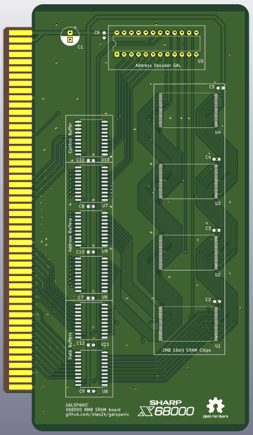

# GALSPanic - X68000 SRAM Expansion

This repo contains Kicad sources for a Static RAM expansion board for Sharp X68000 personal computer.

## Design
The expansion is implemented using 2MB static RAM chips to make the design simpler.
Address decoder is implemented using a ATF22V10 GAL chip. Source code for it is available in `gal/` directory.

Board dimensions are taken from the [midori](https://github.com/tdaede/midiori) project.

The board can support up to 8MB of memory and assumes you already have 2MB built in. If a fourth address line is routed, the board can support 1MB systems by masking half of the first memory chip.

I have tested it on a X68000 Expert system.

## GAL Equations

You can compile `.pld` GAL equations using [GALasm](https://github.com/daveho/GALasm).
